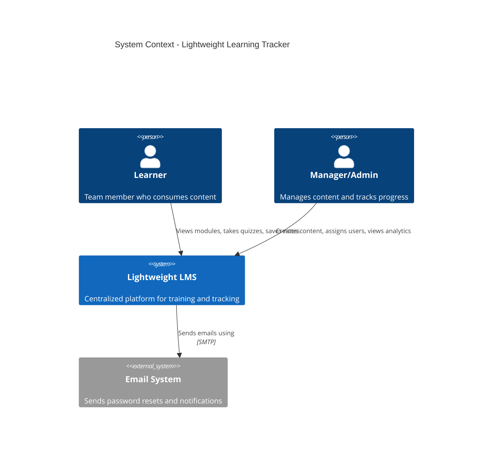
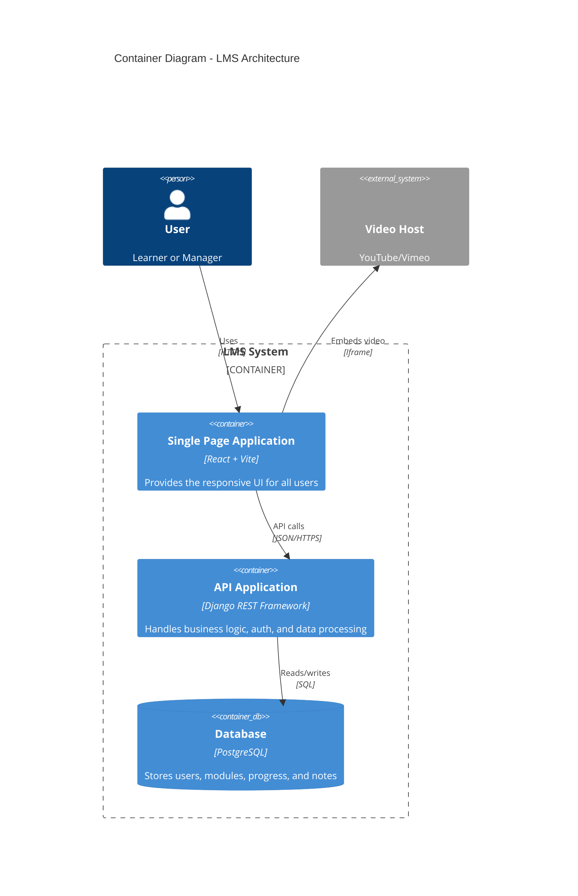

# Lightweight Learning Tracker (LMS v1.0)
## Requirements & Architecture Document

**Version:** 1.0  
**Date:** February 14, 2026  
**Status:** Released (v1.0-enterprise-stable)

---

## 1. Project Overview
The **Lightweight Learning Tracker** is a simple, fast, and efficient web-based platform designed for small-to-medium teams (5-20 members) to manage learning activities in a structured and transparent way. It helps centralize training modules, track each learner’s progress, validate understanding through quizzes, and support personal note-taking—all within a clean and easy-to-use interface.

The system is built using a modern and lightweight architecture approach, focusing on modular design, smooth user experience, and scalable deployment.

**Core Purpose:**
To provide a streamlined and effective learning management workflow without the complexity of traditional LMS tools, enabling teams to learn, track, and improve efficiently.

---

## 2. Objectives
*   **Centralize Learning Content**: Provide one place where all videos, articles, and documents are organized and easy to access.
*   **Track Learner Progress**: Let admins see each learner’s status in real-time (Not Started, In Progress, Completed).
*   **Validate Learning**: Use short quizzes to confirm whether learners understood the material.
*   **Simple, Distraction-Free Interface**: Ensure the platform is clean, easy to use, and focused only on learning.
*   **Support Note-Taking**: Allow learners to write personal notes while studying to improve understanding and retention.

---

## 3. User Roles

### 3.1 Admin (Manager)
**Definition:** The Admin manages all learning activities. They create training modules, assign them to team members, and track overall progress.
*   **Responsibilities**: Create/update modules, assign to learners, monitor results, identify stuck learners.
*   **Needs**: Simple dashboard, clear visibility of progress, automated tracking.

### 3.2 Learner (Team Member)
**Definition:** The Learner consumes training content, completes quizzes, and takes personal notes.
*   **Responsibilities**: View modules, study content, complete quizzes, maintain notes.
*   **Needs**: Clean dashboard, distraction-free player, instant feedback.

---

## 4. System Architecture (C4 Models)

We utilize the **C4 Model** to visualize the architecture, ensuring clarify for developers and stakeholders.

### 4.1 Level 1: System Context Diagram
This diagram shows how Users interact with the LMS and external systems.



### 4.2 Level 2: Container Diagram
This diagram zooms into the LMS to show the separately deployable containers.



---

## 5. Core System Modules

### 5.1 Authentication & User Management
*   **Tech**: JWT Authentication (Django SimpleJWT).
*   **Features**: Login, Signup, Role Management (Admin/Learner), Profile Updates.

### 5.2 Admin Workspace (Content Management)
*   **Module Creation**: Title, Description, Duration, Resources (YouTube URLs), Tags.
*   **Assignments**: Bulk or individual assignment with optional due dates.
*   **Quiz Builder**: Multiple-choice questions, passing score configuration.

### 5.3 Learner Experience (Learning Flow)
*   **Dashboard**: Kanban-style progress (To Do → In Progress → Completed).
*   **Learning Player**:
    *   **Split View**: Content on left, Notes on right.
    *   **Tracking**: Auto-progress updates (heartbeat every 10s).
    *   **Notes**: Private, rich-text editor with auto-save.

### 5.4 Quiz & Validation Engine
*   **Logic**: Block module completion until quiz is passed (default 80%).
*   **Feedback**: Instant scoring and result display.

### 5.5 Analytics & Reporting (Tracking Engine)
*   **Aggregated Score**: `(0.4 * Video) + (0.3 * Quiz) + (0.3 * Assignment)`.
*   **Manager Dashboard**: Real-time grid view of learner status, "Last Active" timestamps, and detailed drill-downs.

---

## 6. Design System & UI/UX

The UI follows the **"Enterprise Light"** design language, focused on clarity and professionalism.

### 6.1 Design Tokens (excerpt)
```css
:root {
  /* Primitives */
  --color-slate-900: #0f172a; /* Primary Text */
  --color-blue-600: #2563eb;  /* Brand/Action */
  --color-green-500: #22c55e; /* Success */
  
  /* Semantic */
  --bg-page: #f8fafc;
  --bg-card: #ffffff;
  --text-body: #475569;
  --focus-ring: 0 0 0 4px rgba(37, 99, 235, 0.2);
}
```

### 6.2 Key UI Principles
*   **Simplicity**: Minimal cognitive load.
*   **Accessibility**: WCAG 2.1 AA Compliant (High contrast, focus states).
*   **Responsiveness**: Mobile-first grid layouts.

---

## 7. Technology Stack

| Component | Technology | Description |
| :--- | :--- | :--- |
| **Frontend** | React 18 | Vite, TailwindCSS, React Router |
| **Backend** | Django 5 | Django REST Framework, SimpleJWT |
| **Database** | PostgreSQL | Relational data integrity |
| **Deployment** | Docker | Containerized Nginx + Gunicorn |

---

## 8. Non-Functional Requirements

### 8.1 Performance
*   **API Latency**: < 300ms for core endpoints.
*   **Frontend**: < 1.5s LCP (Largest Contentful Paint).
*   **Optimization**: Tree-shaking, lazy loading of heavy components (`ReactPlayer`).

### 8.2 Security
*   **Data Protection**: HTTPS verification.
*   **Auth**: Stateless JWT with rotation.
*   **Input Validation**: Django ORM sanitization to prevent SQL injection.

### 8.3 Reliability
*   **Availability**: 99.9% uptime target.
*   **Recovery**: Automated database backups.

---

## Conclusion
The Lightweight Learning Tracker v1.0 delivers a focused, efficient solution for team learning. By combining a **modern React/Django architecture** with **robust tracking** and **clean design**, it ensures accountability and skill growth without enterprise bloat.
